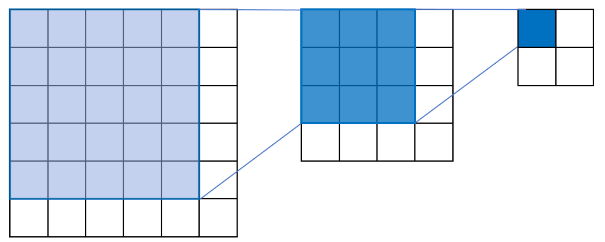

## 卷积操作的进阶

### 感受野

如果原始图片的尺寸是6x6，做一次3x3的卷积后得到4x4的特征图；再做一次3x3的卷积得到2x2的特征图。在4x4的特征图中，每一个特征由原始图片中的3x3像素参与运算得到，所以每个特征的感受野是3x3。同理，2x2的特征图里，一个特征由5x5个像素参与运算得到，所以感受野为5x5。

### Padding

1. 每次经过卷积后，得到新的特征图会变小，在图片原本尺寸就很小的情况下，特征图经过几层就变得非常小，无法进行卷积操作了
2. 卷积操作对于处于图片中央的像素，会被多次用于计算，而处于边缘的像素用于计算的次数则较少。

为了解决这两个问题，人们引入了Padding。
通过给图片周围添加全是0的像素，相当于给原始图片加了一圈黑边。这样在图片边缘的像素也可以参与更多次计算。能够卷积的次数也增加了。

### 生成特征图的尺寸计算

特征图的尺寸主要取决于以下几个参数：

- 输入尺寸：$W_{in}(宽度),\ H_{in}(高度)$
- 卷积核尺寸：K
- 填充值：P
- 步长：S

输出尺寸：$W_{out}(宽度), H_{out}(高度)$
$W_{out} = 1 + \lfloor\frac{W_{in} + 2P - K}{S}\rfloor$
$H_{out} = 1 + \lfloor\frac{H_{in} + 2P - K}{S}\rfloor$

