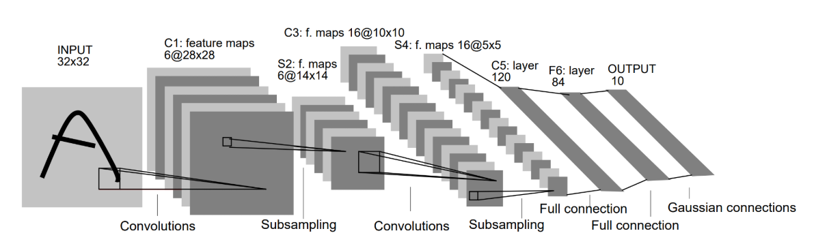

## LeNet

### 1.网络结构



Input： 1x32x32 图像
C1：卷积层，6个5x5卷积核 $\rightarrow$ 输出 6x28x28
S2：平均池化层：$\rightarrow$ 输出 6x14x14
C3：卷积层：16个5x5卷积核 $\rightarrow$ 输出 16x10x10
S4：平均池化层：输出16x5x5
C5：卷积层，120个5x5卷积核 $\rightarrow$ 输出120x1x1（相当于全连接）
F6：全连接层，输出84个神经元
Output：全连接层，输出10类（数字0-9的概率）

==注意==：输入为32x32图像（MNIST是28x28，用zero-padding补足）使用平均池化（Average Pooling）而非现代常见的最大池化（Max Pooling）激活函数为Sigmoid或tanh，而非ReLU

### 2.LeNet的实现

```python
import torch
import torch.nn as nn
import torch.nn.functional as F

class LeNet(nn.Module):
    def __init__(self):
        super(LeNet, self).__init__()
        self.conv1 = nn.Conv2d(1, 6, kernel_size=5)
        self.pool1 = nn.AvgPool2d(kernel_size=2, stride=2)
        self.conv2 = nn.Conv2d(6, 16, kernel_size=5)
        self.pool2 = nn.AvgPool2d(kernel_size=2, stride=2)
        self.conv3 =nn.Conv2d(16, 120, kernel_size=5)
        self.fc1 = nn.Linear(120, 84)
        self.fc2 = nn.Linear(84, 10)
	
    def forward(self, x):
        # C1 + 激活
        x = F.tanh(self.conv1(x))
        x = self.pool1(x)
        x = F.tanh(self.conv2(x))
        x = self.pool2(x)
        x = F.tanh(self.conv3(x))
        # 展平
        x = x.view(-1, 120)
        x = F.tanh(self.conv3(x))
        x = self.fc2(x)
        return x
```

