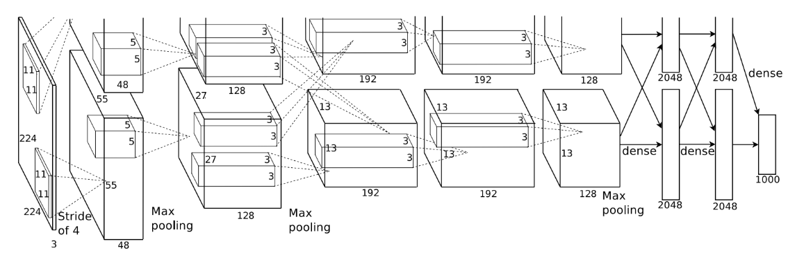

## AlexNet

### 1.网络架构



上图分为上下两个部分，它使用两块GPU来进行并行运算，两个GPU只在特定层进行通讯。

| 层次   | 类型                                            | 输出尺寸  | 说明                       |
| ------ | ----------------------------------------------- | --------- | -------------------------- |
| 输入层 | -                                               | 224x224x3 | RGB图像输入                |
| 第一层 | 卷积层（11x11, stride 4) + ReLU + LRN + MaxPool | 55x55x96  | 较大卷积核用于初始特征提取 |
| 第二层 | 卷积层（5x5, stride 1） + ReLU + LRN + MaxPool  | 27x27x256 | 局部响应归一化提高泛化能力 |
| 第三层 | 卷积层（3x3）+ ReLU                             | 13x13x384 | 更细粒度的特征提取         |
| 第四层 | 卷积层（3x3）+ ReLU                             | 13x13x384 | 与第三层配合提取复杂模式   |
| 第五层 | 卷积层（3x3）+ ReLU + MaxPool                   | 6x6x256   | 下采样提取语义信息         |
| 第六层 | 全连接层 + ReLU + Dropout                       | 4096      | 用于分类的高级特征         |
| 第七层 | 全连接层 + ReLU + Dropout                       | 4096      | 防止过拟合                 |
| 第八层 | 全连接层 + softmax                              | 1000      | 输出1000类概率分布         |

### 实现

```python
import torch
import torch.nn as nn

class AlexNet(nn.Module):
    def __init__(self, num_classes=1000):
        super(AlexNet, self).__init__()
        self.features = nn.Sequential(
        	nn.Conv2d(3, 96, kernel_size=11, stride=4, padding=2),
            nn.ReLU(inplace=True),
            nn.LocalResponseNorm(size=5, alpha=1e-4, beta=0.75, k=2.0),
            nn.MaxPool2d(kernel_size=3, stride=2),
            
            nn.Conv2d(96, 256, kernel_size=5, padding=2),
            nn.ReLU(inplace=True),
            nn.LocalResponeNorm(size=5, alpha=1e-4, beta=0.75, k=2.0),
            nn.MaxPool2d(kernel_size=3, stride=2),
            
            nn.Conv2d(256, 384, kernel_size=3, padding=1),
            nn.ReLU(inplace=True),
            
            nn.Conv2d(384, 384, kernel_size=3, padding=1),
            nn.ReLU(inplace=True)
            
            nn.Conv2d(384, 256, kernel_size=3, padding=1),
            nn.ReLU(inplace=True),
            nn.MaxPool2d(kernel_size=3, stride=2)
        )
        self.classifier = nn.Sequential(
        	nn.Dropout(p=0.5),
            nn.Linear(256*6*6, 4096),
            nn.ReLU(inplace=True),
            
            nn.Dropout(p=0.5),
            nn.Linear(4096, 4096),
            nn.ReLU(inplace=True),
            
            nn.Linear(4096, num_classes)
        )
        
        def forward(self, x):
            x = self.features(x)
            x = x.view(x.size(0), 256*6*6)
            x = self.classifier(x)
            return x
```

