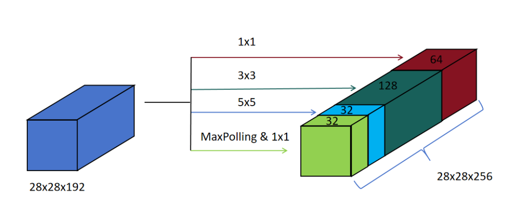
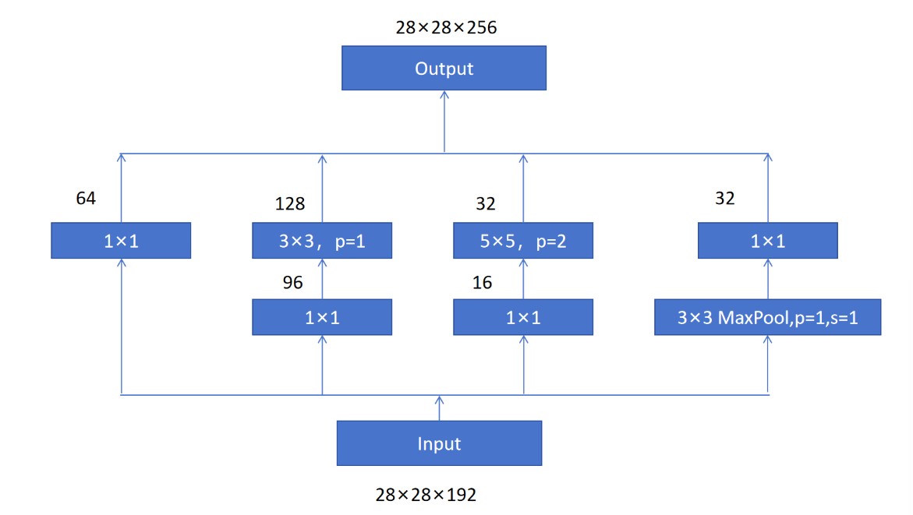
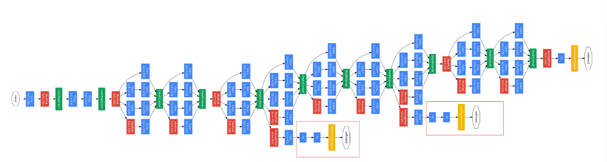

## $GoogLeNet$

### Inception模块

Inception模块把三次卷积和池化的输出特征图拼接在一起，作为特征输出图。

1. 1x1卷积
   设置64个1x1x192的卷积核，输出特征图为28x28x64

2. 3x3卷积

   设置128个3x3x192的卷积核，padding为1，stride为1，输出特征图为28x28x128

3. 5x5卷积

   设置32个5x5x192的卷积核，padding为2，stride为1，输出特征图为28x28x32

4. 最大池化
   设置池化窗口为2x2，padding为1，stride为1（为了保持输出特征图的长宽不变，所以padding为1，stride为1）。输出特征图为28x28x192，再接32个1x1x192的卷积，改变输出特征图为28x28x32

将三次卷积和一次最大池化的输出特征图按通道合并，最终的特征图尺寸为28x28x256。

通过在5x5卷积之前，进行一次1x1卷积，减少计算量，得到下面完整的Inception模块。

### 网络架构

$GoogLeNet$首先通过卷积，池化来提取原始图片的特征，然后是多个Inception模块，接一个$MaxPooling$来降低特征图的长和宽，然后再Inception模块，最终通过全连接层进行分类。
图中用红框标记的部分是辅助特征分类器，增强模型训练的监督信号。