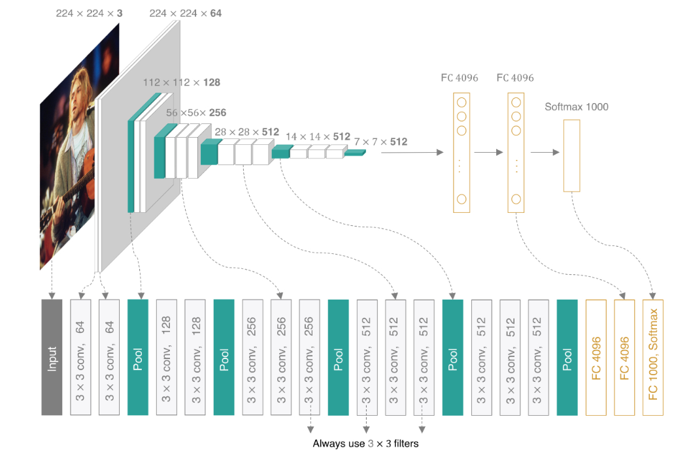

## $VGGNet$

$VGGNet$提出：通过多个连续的小卷积核（3x3）代替大卷积核（如5x5或7x7），可以保证感受野不变的前提下，提高网络的深度和表达能力，同时减少参数。

### 网络架构

使用2个3x3卷积核产生的特征图上每个特征的感受野是5x5，使用三个卷积核感受野为7x7。
通过Padding来实现输入和输出特征图大小一致，只通过最大池化层来减少特征图尺寸。
**统一的池化设计**：在每个卷积层之后使用2x2最大池化层，下采样一般分辨率。
