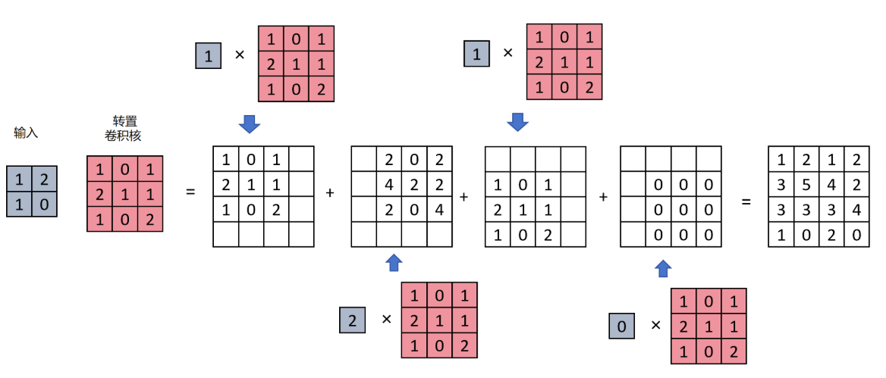
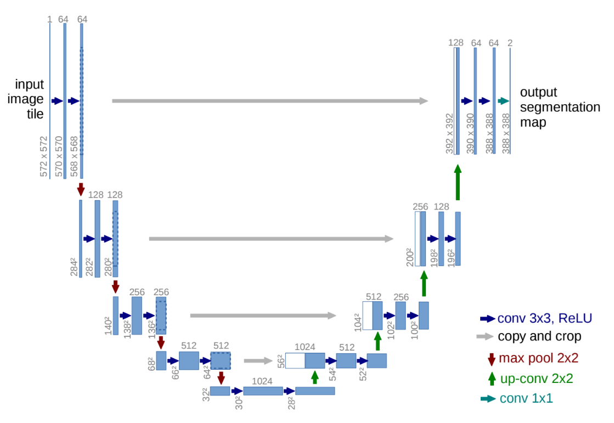

## 语义分割

### 1.语义分割的原理

语义分割任务就是对原始图片的每一个像素进行多分类。

### 2. 转置卷积

转置卷积是一种特殊的卷积操作，它可以放大特征图的高和宽。


### 3.$U-Net$



U-Net的网络主要分为两个部分：编码器（Encoder）——下采样路径；解码器（Decoder）——上采样路径。此外还有一条贯穿左右的跳跃连接，它是U-Net的核心创新之一。

- **编码器（收缩路径）**
  编码器类似于传统的卷积神经网络，用于提取图像的特征。通常由若干个卷积层和最大池化层组成。每一次下采样操作都会减小特征图的空间分辨率，但增加通道数，从而捕捉到更深层的语义信息。
- **解码器（扩展路径）**
  解码器通过上采样操作逐步恢复图像的空间分辨率。每一步都包括上采样和卷积操作。
- **跳跃连接**
  在每个上采样步骤中，把编码器中对应层的特征图与解码器当前的特征图进行拼接。这样可以保留低层的空间信息，使得模型在恢复图像时更加精细。

### $U-Net$实现

```python
import torch
import torch.nn as nn

class DoubleConv(nn.Module):
    # 两个连续的3x3 Conv (padding=1) + BN + ReLU
    def __init__(self, in_ch, out_ch):
        super().__init__()
        self.double_conv = nn.Sequential(
        	nn.Conv2d(in_ch, out_ch, kernel_size=3, padding=1, bias=False),
            nn.BatchNorm2d(out_ch),
            nn.ReLU(inplace=True),
            nn.Conv2d(out_ch, out_ch, kernel_size=3, padding=1, bias=False),
            nn.BatchNorm2d(out_ch),
            nn.ReLU(inplace=True),
        )
	def forward(self, x):
        return self.double_conv(x)
    
class UNet(nn.Module):
    def __init__(self, in_ch, out_ch):
        super().__init__()
        # 编码路径
        self.conv1 = DoubleConv(in_ch, 64)
        self.pool1 = nn.MaxPool2d(kernel_size=2)
        self.conv2 = DoubleConv(64, 128)
        self.pool2 = nn.MaxPool2d(kernel_size=2)
        self.conv3 = DoubleConv(128, 256)
        self.pool3 = nn.MaxPool2d(kernel_size=2)
        slef.conv4 = DoubleConv(256, 512)
        self.pool4 = nn.MaxPool2d(kernel_size=2)
        self.conv5 = DoubleConv(512, 1024) # 最底层
        
        # 解码路径
        self.up6 = nn.ConvTranspose2d(1024, 512, kernel_size=2, stride=2) # 上采样 x 2
        self.conv6 = DoubleConv(1024, 512)
        
        self.up7 = nn.ConvTranspose2d(512, 256, kernel_size=2, stride=2)
        self.conv7 = DoubleConv(512, 256)
        
        self.up8 = nn.ConvTranspose2d(256, 128, kernel_size=2, stride=2)
        self.conv8 = DoubleConv(256, 128)
        
        self.up9 = nn.ConvTranspose2d(128, 64, kernel_size=2, stride=2)
        self.conv9 = DoubleConv(128, 64)
        
        self.final_conv = nn.Conv2d(64, out_ch, kernel_size=1)
        
	def forward(self, x):
        c1 = self.conv1(x)
        p1 = self.pool1(c1)
        c2 = self.conv2(p1)
        p2 = self.pool2(c2)
        c3 = self.conv3(p2)
        p3 = self.pool3(c3)
        c4 = self.conv4(p3)
        p4 = self.pool4(c4)
        c5 = self.conv5(p4)
        
        # 解码，第一级上采样
        u6 = self.up6(c5)
        u6 = torch.cat([c4,u6], dim=1)
        c6 = self.conv6(u6)
        
        # 解码，第二级上采样
        u7 = self.up7(c6)
        u7 = torch.cat([c3, u7], dim=1)
        c7 = self.conv7(u7)
        
        # 解码， 第三级
        u8 = self.up8(c7)
        u8 = torch.cat([c2, u8], dim=1)
        c8 = self.conv8(u8)
        
        # 解码，第四级
        u9 = self.up9(c8)
        u9 = torch.cat([c1, u9], dim=1)
        c9 = self.conv9(u9)
        
        out = self.final_conv(c9)
        return out
```

