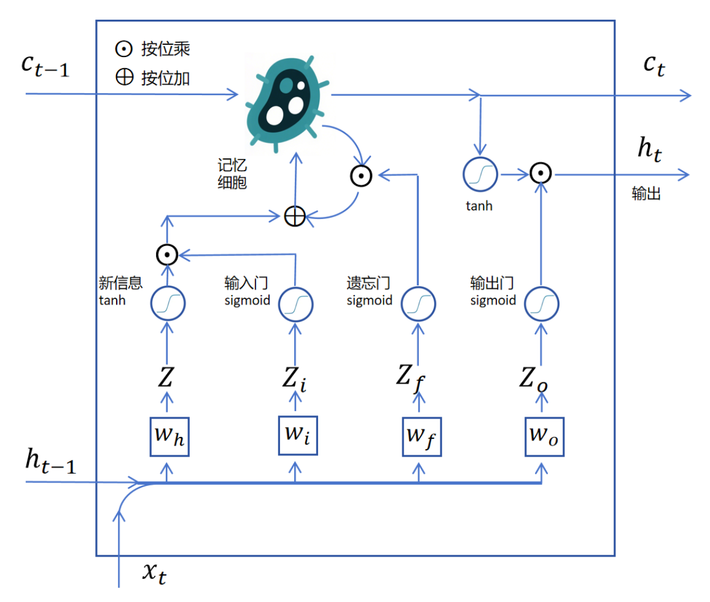
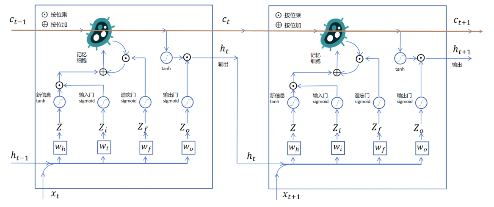

## LSTM

LSTM（Long Short-Term Memory）长短期记忆网络，用于解决RNN没有长期记忆的问题。

输入门/遗忘门/输出门通过分析xt来知道输入/遗忘/输出那些信息。

上面的结构作为模型的循环最小单元，在模型中循环连接。

### 公式化表达

新信息的logits：
$Z = [h_{t-1}| x_t]w_h+b_h$

输入门：
$Z_i = [h_{t-1}|x_t]w_i+b_i$
$G_i = sigmoid(Z_i)$

遗忘门：
$Z_f = [h_{t-1}|x_t]w_f+b_f$
$G_f = sigmoid(Z_f)$

输出们：
$Z_o = [h_{t-1}|w_t]w_0 + b_o$
$G_o = sigmoid(Z_o)$

记忆细胞：
$c_t = C_{t-1} \odot G_f + tanh(Z) \odot G_i$

隐状态：
$h_t = tanh(c_t) \odot G_0$

