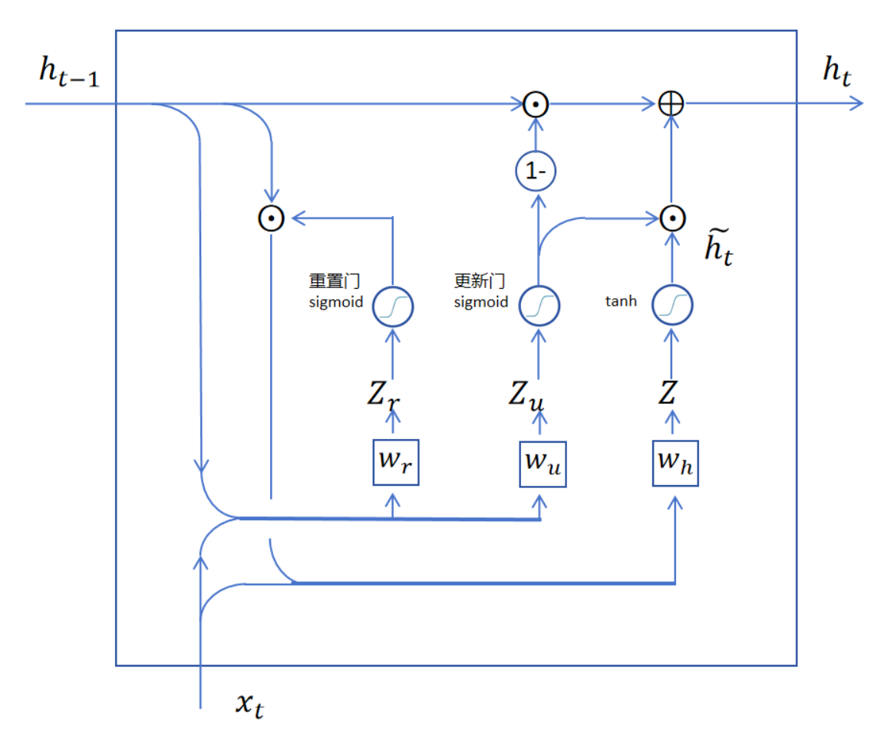

## GRU

门控循环单元（Gated Recurrent Unit，GRU）是对LSTM的简化版，实验表明，GRU的性能基本和LSTM相当。

### 1.GRU的网络结构

GRU去掉了LSTM中的记忆细胞状态$c_t$，仅用隐状态$h_t$就解决了长期记忆和梯度消失的问题。

### 2.公式化表示

重置门：
$G_r = sigmoid([h_{t-1}|x_t]w_r+b_r)$

更新门：
$G_u = sigmoid([h_{t-1}|x_t]w_u+b_u)$

备用输出：
$\hat{h}_t = tanh([h_{t-1} \odot G_r|x_t]w_h+b_h)$

隐状态：
$h_t = G_u \odot \hat{h}_t + (1-G_u) \odot h_{t-1}$
