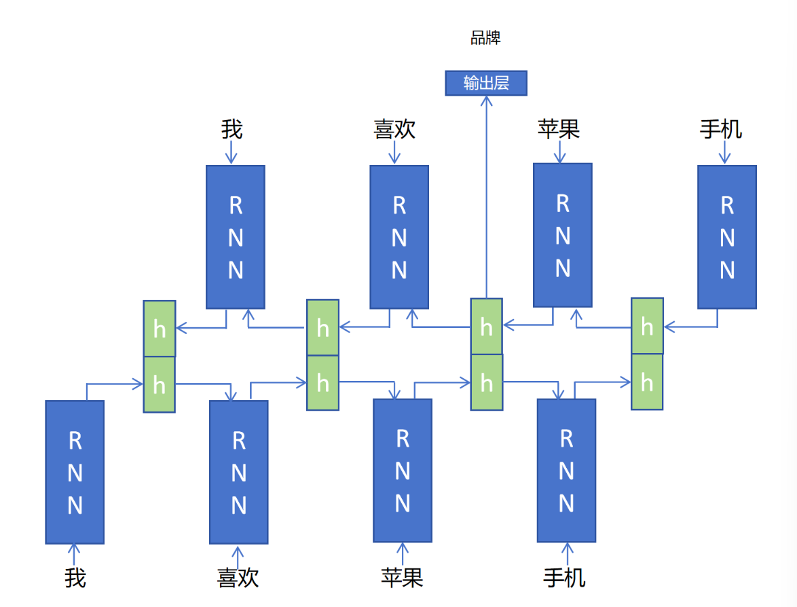

## 双向循环神经网络

### 1.单向循环神经网络的局限性

仅依靠之前的token可能无法判断当前token的含义，必须通过后续的token来判断当前token的含义。

1. 我喜欢**<u>苹果</u>**味的汽水。
2. 我喜欢**<u>苹果</u>**手机。

### 2. $BiRNN$的结构

创建两个RNN，一个序列正向循环，一个对序列反向循环。然后把对应的某个序列元素的在正向和反向循环输出的隐状态进行合并，再作为完成特定任务的普通层的输入。
