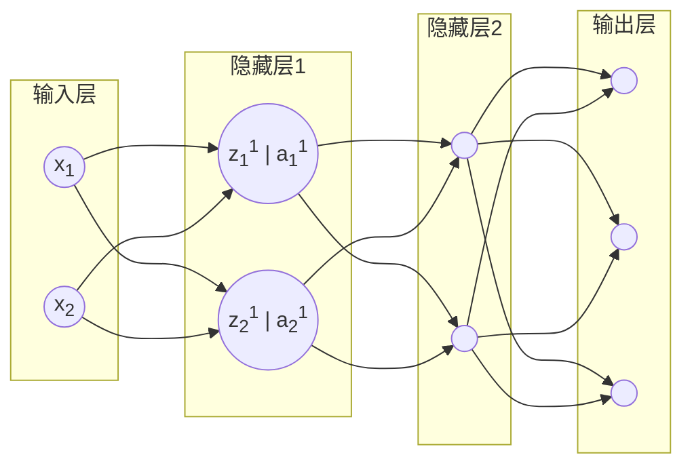

## 批量归一化

网络浅层学习到的是基本特征，网络深层特征基于浅层基本特征学到抽象特征，如果没有批量归一化，每一层的输出在训练过程中给一直在变化，导致网络深层刚学到的模式，因为输入的大幅度变化又失效了，需要重新学习。所以需要**对每一层的输出进行归一化，保证下一层的输入在稳定范围内**。

除此之外，批量归一化还有**防止模型过拟合**的作用。

### 具体实现

以上图的神经网络结构为例：
对于$z_1^1$，i表示第i个样本$z_1^1$的值，$\epsilon$是为了防止除0，加的一个很小的数
$(z_1^1)_{norm}^i \ = \ \frac{(z_1^1)^i-\eta_1^1}{\sigma_1^1 +\epsilon}$
接下来，还需要对$(z_1^1)_{norm}$进行一个线性变化，才能得到最终$Batch Norm$后的结果。
$(z_1^1)_{BN} = \gamma_1^1(z_1^1)_{norm} \ + \ \beta_1^1$
其中$\gamma,\beta$都和权重一样是可以学习的参数。会在模型训练中进行更新。
对于$z_1^1$而言，如果：
$\gamma_1^1 = \sigma_1^1 + \epsilon$
$\beta_1^1 = \mu_1^1$
那么$(z_1^1)_{BN} = z_1^1$可以看到如果模型是有可能通过学习调整$\gamma,\beta$的值，让批量归一化后的值等于原始值的。