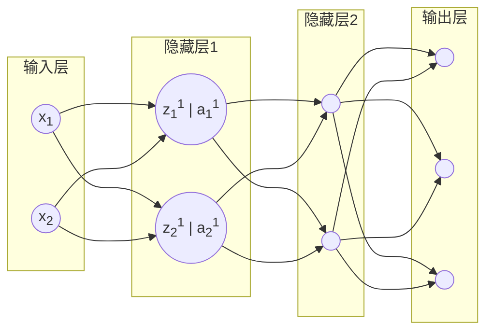

## 批量归一化

网络浅层学习到的是基本特征，网络深层特征基于浅层基本特征学到抽象特征，如果没有批量归一化，每一层的输出在训练过程中给一直在变化，导致网络深层刚学到的模式，因为输入的大幅度变化又失效了，需要重新学习。所以需要**对每一层的输出进行归一化，保证下一层的输入在稳定范围内**。

除此之外，批量归一化还有**防止模型过拟合**的作用。

### 具体实现



以上图的神经网络结构为例：
对于$z_1^1$，i表示第i个样本$z_1^1$的值，$\epsilon$是为了防止除0，加的一个很小的数。$\mu，\sigma$是在每个batch的数据上计算得到的均值和标准差。
$(z_1^1)_{norm}^i \ = \ \frac{(z_1^1)^i-\eta_1^1}{\sigma_1^1 +\epsilon}$
接下来，还需要对$(z_1^1)_{norm}$进行一个线性变化，才能得到最终$Batch Norm$后的结果。
$(z_1^1)_{BN} = \gamma_1^1(z_1^1)_{norm} \ + \ \beta_1^1$
其中$\gamma,\beta$都和权重一样是可以学习的参数。会在模型训练中进行更新。
对于$z_1^1$而言，如果：
$\gamma_1^1 = \sigma_1^1 + \epsilon$
$\beta_1^1 = \mu_1^1$
那么$(z_1^1)_{BN} = z_1^1$可以看到如果模型是有可能通过学习调整$\gamma,\beta$的值，让批量归一化后的值等于原始值的。
一般设置**$\gamma = 1, \beta = 0$**，这样大多数情况下，它都限制输出的均值在0，标准差在1附近。

### 推理时的批量归一化

1. **训练阶段**
   对当前的$mini-batch$中的每个特征，计算均值$\mu$和方差$\sigma_2$:
   $\mu_{batch}=\frac{1}{m}\sum_{i=1}^m z_i,\ \ \sigma_{batch}^2=\frac{1}{m}\sum_{i=1}^m (z_i-\mu_{batch})^2$

   用它们对该batch的z做归一化：
   $\hat{z}_i = \frac{z_i - \mu_{batch}}{\sqrt{\sigma_{batch}^2+\epsilon}}$
   同时维护一个滑动平均的均值和方差：
   $\mu_{running} \leftarrow (1-\alpha)\mu_{running}+\alpha\mu_{batch}$
   $\sigma_{running}^2 \leftarrow (1-\alpha)\sigma_{running}^2+\alpha\sigma_{batch}^2$
   其中$\alpha$是$momentum$（动量系数）。
   
2. **推理阶段**
   直接用训练过程中累积的$running \ mean$和$running \ vartance$来进行会归一化：
   $\hat{z} = \frac{z-\mu_{running}}{\sqrt{\sigma_{running}^2+\epsilon}}$

### 在$PyTorch$里添加批量归一化

```python
import torch.nn as nn
class NeuralNetwork(nn.Module):
    def __init__(self):
        super().__init__()
        self.model = nn.Sequential(
            # bias 决定是否在全连接层中加上偏置项(bias)
            # 因为下一层是BatchNorm,BatchNorm里有可学习的平移参数(beta),功能类似bias
            nn.Linear(28 * 28, 128, bias=False),
            nn.BatchNorm1d(128),
            nn.ReLU(),
            
            nn.Linear(128, 128, bias=False),
            nn.BatchNorm1d(128),
            nn.ReLU(),
            
            nn.Linear(128, 128, bias=False),
            nn.BatchNorm1d(128),
            nn.ReLU(),
            
            nn.Linear(128, 64, bias=False),
            nn.BatchNorm1d(64),
            nn.ReLU(),
            
            nn.Linear(64, 10)
        )
	
    def forward(self, x):
        return self.model(x)
```

训练时和推理时的$Batch \ Normalization$的操作是一样的，记得用$model.train()$和$model.eval()$来切换模式的状态。

### $Linear$层与$BatchNorm$层

在$BatchNorm$中，除了均值方差归一化部分，它还包含两个可学习参数：
$y = \gamma \cdot \hat{x} + \beta$

- $\gamma(gamma)$:缩放系数，用来调整标准化后特征的尺度。
- $\beta(beta)$:平移系数(shift)，用来调整标准化后特征的中心位置

既然$BatchNorm$层也有可以学习的$\gamma,\beta$，为什么还需要$Linear$层呢：

- $BatchNorm$的作用:
  主要是**规范化**：把不同batch里的特征分布拉回到均值和方差稳定的状态，缓解梯度消失\爆炸
  $\gamma,\beta$只是逐通道的缩放和平移（每个特征维度独立处理），不能捕捉不同特征之间的组合关系
- $Linear$层的作用：
  主要是**学习特征之间的线性组合:**
  $y = xW^T+b$
  这里的W是一个矩阵，可以让每个输出的特征由多个输入特征加权组合得到。
  本质上是改变特征空间的表达方式，提取更复杂的特征。

==举例说明==：

$x = [x_1,x_2]$

1. $BatchNorm$:
   $y_1 = \gamma_1\cdot\hat{x}_1+\beta_1,\ y_2 = \gamma_2\cdot\hat{x}_2+\beta_2$
   每个特征单独缩放和平移
2. $Linear$:
   $y_1 = W_{11}x_1+w_{12}x_2+b_1,\ y_2 = w_{21}x_1+w_{22}x_2+b_2$
   每个输出特征可以是**输入特征的任意线性组合**，表达能力更强
